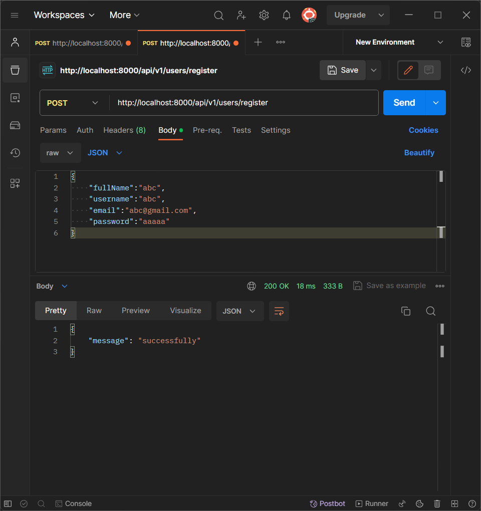

### Logic building | Register controller ([link here](https://www.youtube.com/watch?v=VKXnSwNm_lE))

1. [Get User Details from Frontend (Postman)](#1-get-user-details-from-frontend-postman)
2. [Validation - Not Empty](#2-validation-not-empty)
3. [Check if User Already Exists: Email, Username](#3-check-if-user-already-exists-email-username)
4. [Check if User Has Images and Avatar](#4-check-if-user-has-images-and-avatar)
5. [Upload Images to Cloudinary (Multer Integration)](#5-upload-images-to-cloudinary-multer-integration)
6. [Create User Object - Database Entry](#6-create-user-object-database-entry)
7. [Remove Password and Refresh Token from Response and Check for User Creation](#7-remove-password-and-refresh-token-from-response-and-check-for-user-creation)
8. [Return Response](#8-return-response)

## 1. Get User Details from Frontend (Postman)

<details>
<summary>Ensure the frontend, preferably using Postman, sends the necessary user details.</summary>

```js
const registerUser = asyncHandler(async (req, res) => {
  const { fullName, username, email, password } = req.body;

  console.log({ email });
  console.log(req.body);

  return res.status(200).json({ message: "successfully" });
});
```

```js
// 1.
console.log({ email }); // { email: "abc@gmail.com" }

// 2.
console.log(req.body);
// {
//   fullName: 'abc',
//   username: 'abc',
//   email: 'abc@gmail.com',
//   password: 'aaaaa'
// }
```



</details>

## Note

<details>
 <summary>Adding  a middleware in routes</summary>

- Add a middleware
- upload the Image ,avatar using multer to push to Cloudinary server

```js
import { Router } from "express";
import { registerUser, loginUser } from "../controllers/user.controller.js";

import { upload } from "../middlewares/multer.middleware.js";

const router = Router();

router.post(
  "/register",
  upload.fields([
    { name: "avatar", maxCount: 1 },
    { name: "coverImage", maxCount: 1 },
  ]),
  registerUser
);

router.post("/login", loginUser);

export default router;
```

</details>

## 2. Validation - Not Empty

<details>
<summary>Validate the received user details to ensure none of the fields are empty.</summary>

```js
const registerUser = asyncHandler(async (req, res) => {
  const { fullName, username, email, password } = req.body;

  // if (fullName) {
  //   throw new ApiError(400, "fullName is required");
  // }

  if (
    [fullName, username, email, password].some((field) => field?.trim() === "")
  ) {
    throw new ApiError(400, "All field is required");
  }

  return res.status(200).json({ message: "successfully" });
});
```

```js
if (fullName) {
  throw new ApiError(400, "fullName is required");
}
```

```js
if (
  [fullName, username, email, password].some((field) => field?.trim() === "")
) {
  throw new ApiError(400, "All field is required");
}
```

</details>

## 3. Check if User Already Exists: Email, Username

<details>
<summary>Verify the existence of the user by checking for duplicate email and username.</summary>

```js
import { User } from "../models/user.model.js";

const registerUser = asyncHandler(async (req, res) => {
  const { fullName, username, email, password } = req.body;

  if (
    [fullName, username, email, password].some((field) => field?.trim() === "")
  ) {
    throw new ApiError(400, "All field is required");
  }

  const exitedUser = await User.findOne({
    $or: [{ email }, { username }],
  });

  if (exitedUser) {
    throw new ApiError(409, "User with email or username already exited");
  }

  return res.status(200).json({ message: "successfully" });
});
```

```js
import { User } from "../models/user.model.js";

const exitedUser = await User.findOne({
  $or: [{ email }, { username }],
});
```

```js
if (exitedUser) {
  throw new ApiError(409, "User with email or username already exited");
}
```

</details>

## 4. Check if User Has Images and Avatar

<details>
<summary>Determine whether the user has uploaded images and an avatar.</summary>

```js
const registerUser = asyncHandler(async (req, res) => {
  const { fullName, username, email, password } = req.body;

  if (
    [fullName, username, email, password].some((field) => field?.trim() === "")
  ) {
    throw new ApiError(400, "All field is required");
  }

  const exitedUser = await User.findOne({
    $or: [{ email }, { username }],
  });

  if (exitedUser) {
    throw new ApiError(409, "User with email or username already exited");
  }

  const avatarLocalPath = req.files?.avatar[0]?.path;
  const coverImageLocalPath = req.files?.coverImage[0]?.path;

  if (!avatarLocalPath) {
    throw new ApiError(400, "Avatar file is required");
  }

  return res.status(200).json({ message: "successfully" });
});
```

```js
/**
 *  router.post(
 *   "/register",
 *   upload.fields([
 *     { name: 'avatar', maxCount: 1 },
 *     { name: 'coverImage', maxCount: 1 }
 *   ]),
 *   registerUser
 * );
 */

const avatarLocalPath = req.files?.avatar[0]?.path;
const coverImageLocalPath = req.files?.coverImage[0]?.path;
```

```js
if (!avatarLocalPath) {
  throw new ApiError(400, "Avatar file is required");
}
```

</details>

## 5. Upload Images to Cloudinary (Multer Integration)

<details>
<summary>Integrate Multer to verify the proper functioning of image uploading. If images are present, upload them to Cloudinary.</summary>

```js
const registerUser = asyncHandler(async (req, res) => {
  const { fullName, username, email, password } = req.body;

  if (
    [fullName, username, email, password].some((field) => field?.trim() === "")
  ) {
    throw new ApiError(400, "All field is required");
  }

  const exitedUser = await User.findOne({
    $or: [{ email }, { username }],
  });

  if (exitedUser) {
    throw new ApiError(409, "User with email or username already exited");
  }

  const avatarLocalPath = req.files?.avatar[0]?.path;
  const coverImageLocalPath = req.files?.coverImage[0]?.path;

  if (!avatarLocalPath) {
    throw new ApiError(400, "Avatar file is required");
  }

  const avatar = await uploadOnCloudinary(avatarLocalPath);
  const coverImage = await uploadOnCloudinary(coverImageLocalPath);

  if (!avatar) {
    throw new ApiError(400, "Avatar file is required");
  }

  return res.status(200).json({ message: "successfully" });
});
```

```js
const avatar = await uploadOnCloudinary(avatarLocalPath);
const coverImage = await uploadOnCloudinary(coverImageLocalPath);
```

```js
if (!avatar) {
  throw new ApiError(400, "Avatar file is required");
}
```

</details>

## 6. Create User Object - Database Entry

<details>
<summary>Construct a user object with the validated details. Create an entry for the user in the database.</summary>

```js
const registerUser = asyncHandler(async (req, res) => {
  const { fullName, username, email, password } = req.body;

  if (
    [fullName, username, email, password].some((field) => field?.trim() === "")
  ) {
    throw new ApiError(400, "All field is required");
  }

  const exitedUser = await User.findOne({
    $or: [{ email }, { username }],
  });

  if (exitedUser) {
    throw new ApiError(409, "User with email or username already exited");
  }

  const avatarLocalPath = req.files?.avatar[0]?.path;
  const coverImageLocalPath = req.files?.coverImage[0]?.path;

  if (!avatarLocalPath) {
    throw new ApiError(400, "Avatar file is required");
  }

  const avatar = await uploadOnCloudinary(avatarLocalPath);
  const coverImage = await uploadOnCloudinary(coverImageLocalPath);

  if (!avatar) {
    throw new ApiError(400, "Avatar file is required");
  }

  const user = await User.create({
    fullName,
    email,
    password,
    username: username.toLowerCase(),
    avatar: avatar.url,
    coverImage: coverImage?.url || "",
  });

  if (!user) {
    throw new ApiError(400, "Invalid user");
  }

  return res.status(200).json({ message: "successfully" });
});
```

```js
const user = await User.create({
  fullName,
  email,
  password,
  username: username.toLowerCase(),
  avatar: avatar.url,
  coverImage: coverImage?.url || "",
});

if (!user) {
  throw new ApiError(400, "Invalid user");
}
```

</details>

## 7. Remove Password and Refresh Token from Response and Check for User Creation

<details>
<summary>Ensure sensitive information, such as passwords and refresh tokens, is excluded from the response for security reasons. Verify the success of the user creation process.</summary>

```js
const registerUser = asyncHandler(async (req, res) => {
  const { fullName, username, email, password } = req.body;

  if (
    [fullName, username, email, password].some((field) => field?.trim() === "")
  ) {
    throw new ApiError(400, "All field is required");
  }

  const exitedUser = await User.findOne({
    $or: [{ email }, { username }],
  });

  if (exitedUser) {
    throw new ApiError(409, "User with email or username already exited");
  }

  const avatarLocalPath = req.files?.avatar[0]?.path;
  const coverImageLocalPath = req.files?.coverImage[0]?.path;

  if (!avatarLocalPath) {
    throw new ApiError(400, "Avatar file is required");
  }

  const avatar = await uploadOnCloudinary(avatarLocalPath);
  const coverImage = await uploadOnCloudinary(coverImageLocalPath);

  if (!avatar) {
    throw new ApiError(400, "Avatar file is required");
  }

  const user = await User.create({
    fullName,
    email,
    password,
    username: username.toLowerCase(),
    avatar: avatar.url,
    coverImage: coverImage?.url || "",
  });

  if (!user) {
    throw new ApiError(400, "Invalid user");
  }

  const createdUser = await User.findById(user._id).select(
    "-password -refreshToken"
  );

  if (!createdUser) {
    throw new ApiError(500, "Something went wrong while registering the user");
  }

  return res.status(200).json({ message: "successfully" });
});
```

```js
const createdUser = await User.findById(user._id).select(
  "-password -refreshToken"
);

if (!createdUser) {
  throw new ApiError(500, "Something went wrong while registering the user");
}
```

</details>

## 8. Return Response

<details>
<summary>Provide a well-structured response, clearly indicating the outcome of the user registration process.</summary>

```js
const registerUser = asyncHandler(async (req, res) => {
  const { fullName, username, email, password } = req.body;

  if (
    [fullName, username, email, password].some((field) => field?.trim() === "")
  ) {
    throw new ApiError(400, "All field is required");
  }

  const exitedUser = await User.findOne({
    $or: [{ email }, { username }],
  });

  if (exitedUser) {
    throw new ApiError(409, "User with email or username already exited");
  }

  const avatarLocalPath = req.files?.avatar[0]?.path;
  const coverImageLocalPath = req.files?.coverImage[0]?.path;

  if (!avatarLocalPath) {
    throw new ApiError(400, "Avatar file is required");
  }

  const avatar = await uploadOnCloudinary(avatarLocalPath);
  const coverImage = await uploadOnCloudinary(coverImageLocalPath);

  if (!avatar) {
    throw new ApiError(400, "Avatar file is required");
  }

  const user = await User.create({
    fullName,
    email,
    password,
    username: username.toLowerCase(),
    avatar: avatar.url,
    coverImage: coverImage?.url || "",
  });

  if (!user) {
    throw new ApiError(400, "Invalid user");
  }

  const createdUser = await User.findById(user._id).select(
    "-password -refreshToken"
  );

  if (!createdUser) {
    throw new ApiError(500, "Something went wrong while registering the user");
  }

  return res
    .status(201)
    .json(new ApiResponse(200, createdUser, "User Registered Successfully"));
});
```

```js
return res
  .status(201)
  .json(new ApiResponse(200, createdUser, "User Registered Successfully"));
```

</details>
